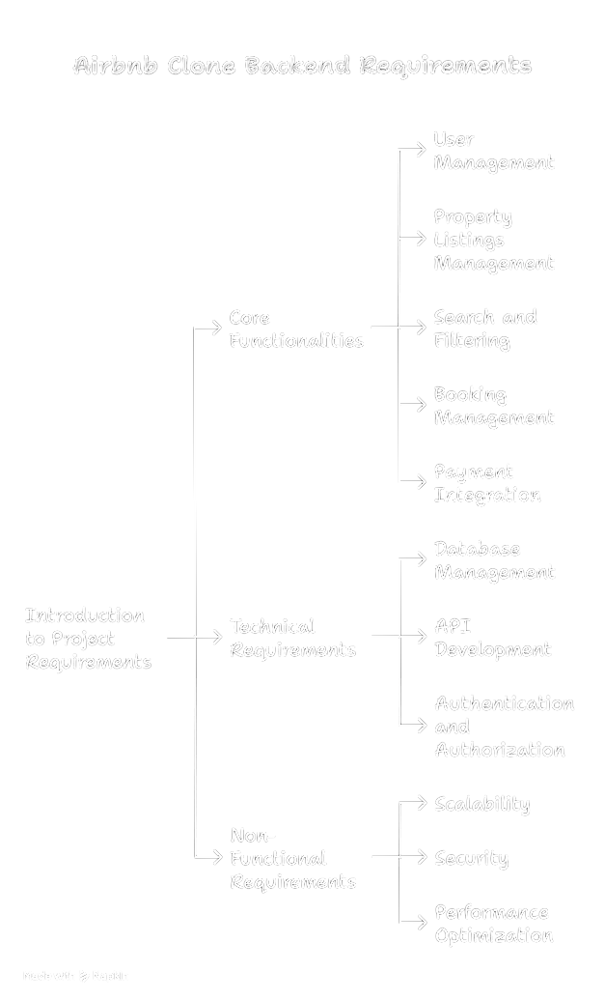

# Airbnb Clone – Backend Features and Functionalities

This directory contains a visual diagram outlining the key backend features of the Airbnb Clone project.

## Key Modules

- **User Authentication**
  - Registration, Login, Logout
  - Password encryption
  - Token-based authentication

- **Property Management**
  - Create, update, delete properties
  - Upload images
  - Manage listings

- **Booking System**
  - Create and manage bookings
  - View booking history
  - Cancel reservations

- **Payments**
  - Process payments
  - Issue refunds
  - Track payment status

## Diagram

The system architecture and feature flow is illustrated in the diagram below:

